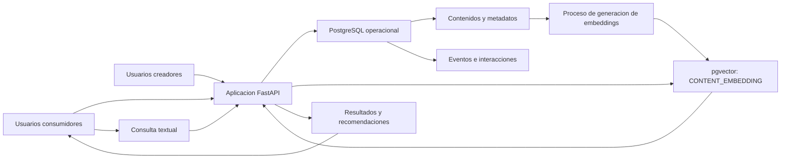

# Arquitectura de datos

## Alcance

La solucion utiliza una arquitectura simple de capas. Se mantiene PostgreSQL como almacenamiento principal y se incorpora pgvector dentro del mismo motor para resolver busquedas semanticas. No se agrega un Data Warehouse, Data Lake ni una base vectorial independiente porque el volumen y el alcance del trabajo son academicos.

## Flujo general

## Capas

### Fuentes y usuarios

Los usuarios consumidores generan busquedas, visualizaciones, reacciones y compartidos. Los usuarios creadores ingresan y modifican contenidos, categorias y etiquetas mediante la aplicacion.

### Ingestion y aplicacion

FastAPI recibe formularios y consultas, valida los datos basicos y ejecuta operaciones sobre PostgreSQL. En esta implementacion no se incorpora una cola de mensajes porque la carga esperada es reducida.

### Almacenamiento operacional

PostgreSQL almacena:

- usuarios y roles;
- contenidos y sus tipos especificos;
- categorias y etiquetas;
- preferencias;
- historial;
- busquedas;
- interacciones;
- denuncias y acciones de gestion.

Las relaciones se mantienen mediante claves primarias, claves foraneas y restricciones de integridad.

### Preparacion para IA

Un proceso en Python lee los textos disponibles de los contenidos, los divide en fragmentos y genera embeddings con `all-MiniLM-L6-v2`. Los vectores se guardan en `CONTENT_EMBEDDING`, vinculados mediante `content_id` al contenido original.

### Consulta y consumo

La aplicacion ejecuta consultas SQL convencionales para recuperar contenidos y consultas vectoriales para encontrar fragmentos semanticamente similares. Los resultados se muestran al usuario y pueden utilizarse como base para recomendaciones simples.

## Datos crudos, procesados y preparados para IA

- **Datos ingresados:** titulos, textos, descripciones, categorias, etiquetas y eventos de interaccion.
- **Datos procesados:** fragmentos de texto y metricas obtenidas mediante consultas SQL.
- **Datos preparados para IA:** embeddings almacenados en `CONTENT_EMBEDDING`.
- **Datos consumidos:** listados de contenidos, resultados de busqueda y posibles recomendaciones.

En el alcance actual no se implementa un almacenamiento separado para cada etapa. Las tablas operacionales y vectoriales se mantienen en PostgreSQL para reducir complejidad.

## Justificacion de la arquitectura

Una arquitectura simple es suficiente porque:

- el volumen de datos de prueba es reducido;
- las relaciones entre entidades son importantes;
- se necesita consistencia entre contenidos e interacciones;
- la busqueda semantica puede resolverse con pgvector;
- se busca demostrar el modelo de datos y no construir una plataforma productiva;
- un unico motor facilita la ejecucion y la explicacion del trabajo.

## Evolucion posible

Si aumentaran los usuarios, contenidos o consultas, se podrian incorporar:

- una cola para procesar interacciones de forma asincronica;
- un almacenamiento analitico separado para historiales y metricas;
- generacion de embeddings como proceso independiente;
- cache para contenidos y recomendaciones frecuentes;
- particionamiento de tablas de eventos como `HISTORY` e `INTERACTION`;
- replicas de lectura para distribuir consultas;
- un servicio vectorial separado si pgvector dejara de ser suficiente.
